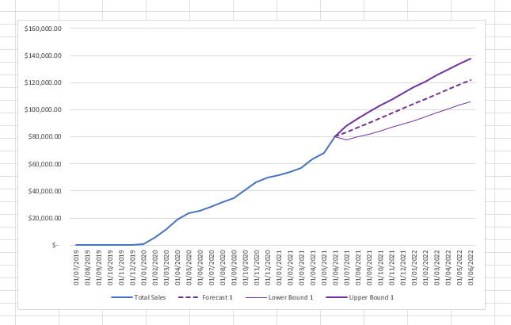
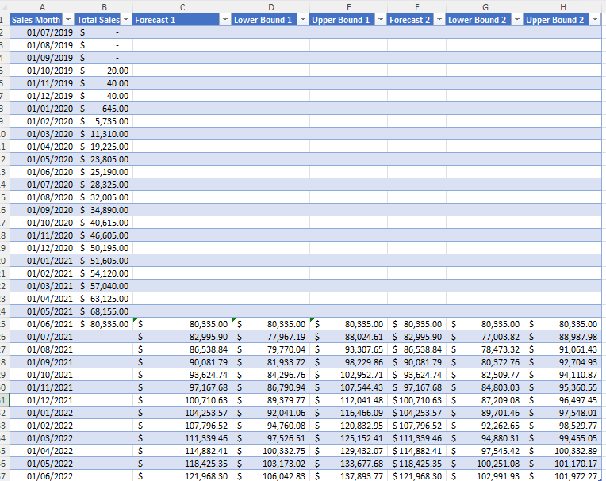
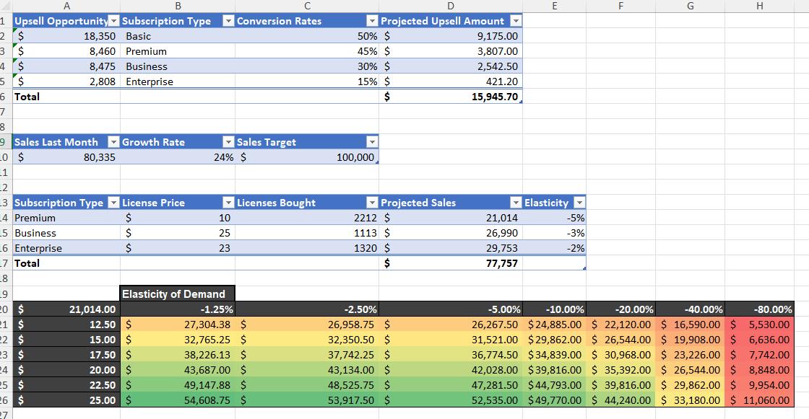

# Forecasting and Scenario Analysis Project

## Overview

This project utilizes Microsoft Excel to perform advanced forecasting and scenario analysis for a subscription-based business. The primary objectives are to predict future sales, assess upsell opportunities, and analyze the impact of pricing and demand changes on revenue. The project is divided into several key components:

1. **Sales Forecasting**: Utilizes historical sales data to forecast future sales using methods like Simple Moving Average (SMA) and Weighted Moving Average. Additionally, it includes the Exponential Smoothing (ETS) method to provide more accurate forecasts.
   
2. **Upsell Opportunity Analysis**: Evaluates potential upsell opportunities across different subscription types based on conversion rates and historical upsell data.

3. **Scenario Analysis**: Examines the impact of different pricing strategies and demand elasticity on projected sales to support strategic decision-making.

## Skills Gained

- **Data Analysis and Forecasting**: Learned to apply various forecasting methods to predict future sales trends. Gained experience using Excel functions to manipulate data and calculate forecasts.
- **Scenario Planning**: Acquired skills in conducting scenario analysis to evaluate the effects of different variables on business outcomes.
- **Data Visualization**: Enhanced the ability to create insightful charts and graphs to communicate findings clearly and effectively.
- **Advanced Excel Functions**: Improved proficiency in using a range of Excel functions and tools for data analysis, including PivotTables, forecasting functions, and various lookup functions.

## Functions and Tools Used

- **`FORECAST.ETS`**: Used to predict future values based on a time series using the Exponential Smoothing (ETS) algorithm, providing a robust forecasting model that accounts for seasonality.
- **`FORECAST.ETS.CONFINT`**: Calculates the confidence interval for a forecasted value, offering a range of potential future sales figures to understand forecast reliability.
- **`SUMIF`**: Summed specific values based on criteria, such as calculating total upsell amounts for different subscription types.
- **`SMA` and `Weighted Moving Average`**: Implemented these methods to smooth out historical data for trend analysis and forecasting.
- **`IF` and `VLOOKUP`**: Used for conditional logic and data retrieval, respectively, to enhance data analysis and automation within the Excel models.
- **`PivotTables`**: Employed to aggregate and summarize data, allowing detailed breakdowns of sales and upsell opportunities by subscription type and other criteria.
- **Data Visualization Tools**: Utilized Excel's charting tools to create line charts, area charts, and heatmaps for visualizing trends, forecasts, and scenario analyses.

## Project Components

### 1. **Sales Forecasting**

- **Objective**: Forecast future sales using historical data to guide inventory and marketing decisions.
- **Methods Used**:
  - **Simple Moving Average (SMA)**
  - **Weighted Moving Average**
  - **Exponential Smoothing (ETS)**
  
- **Visualization**: The line chart below shows actual sales vs. forecasted sales, including confidence intervals for the ETS forecasts.

### 2. **Upsell Opportunity Analysis**

- **Objective**: Analyze upsell opportunities to identify potential revenue growth areas.
- **Approach**:
  - Calculated projected upsell amounts using conversion rates.
  - Summarized upsell data by subscription type using `SUMIF` and other aggregation functions.

- **Data Table**: The table below provides a detailed view of the upsell opportunities and conversion rates.

- **Outcome**: Identified high-value upsell opportunities across different customer segments, helping to focus marketing and sales efforts.

### 3. **Scenario Analysis**

- **Objective**: Understand the impact of different pricing and demand scenarios on projected sales and revenue.
- **Methods Used**:
  - Created a sensitivity analysis table to explore how changes in price and demand elasticity affect sales.
  - Used heatmaps to visualize the impact of different scenarios on revenue.

- **Visualization**: The table and heatmap below illustrate the elasticity of demand and the projected sales for various pricing strategies.

- **Insights**: Provided actionable insights into pricing strategy, helping to identify optimal price points and understand market sensitivity.

## Conclusion

The Forecasting and Scenario Analysis Project provides valuable insights into future sales trends, upsell opportunities, and the impact of various business strategies on revenue. By leveraging advanced Excel functions and data visualization techniques, this project enables data-driven decision-making and strategic planning for business growth.
